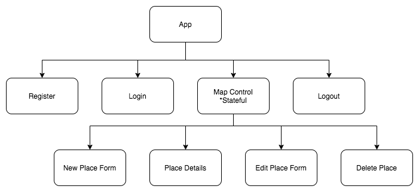
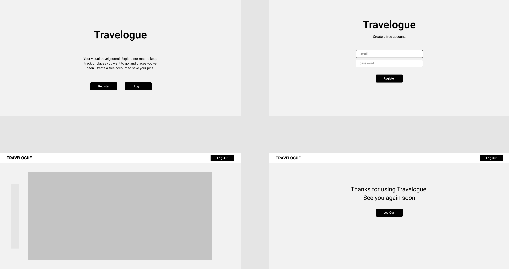
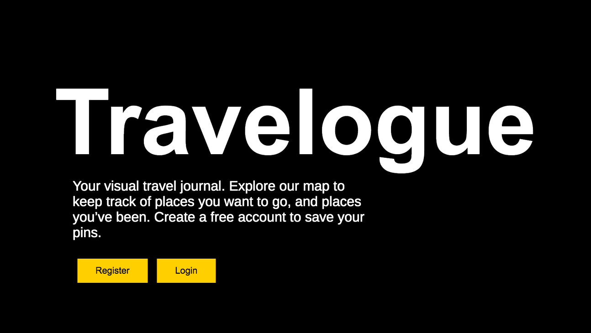
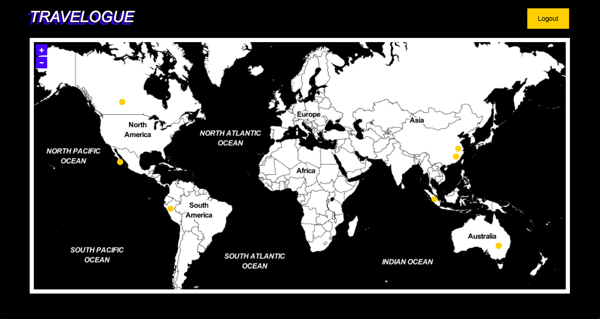
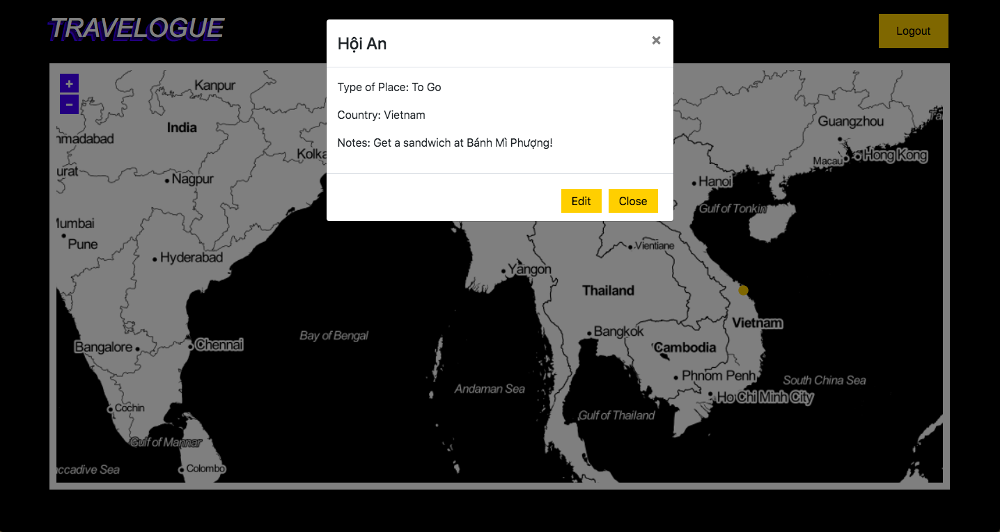
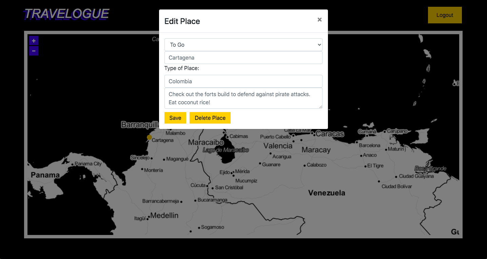

# Travelogue

### Epicodus Capstone Project

### By Kate Skorija
<br>

## Description
Travelogue is a visual resource for users to keep track of places they’ve been, and places they would like to go.
Users can explore a world map and place pins on locations, updating the pins with descriptions and notes as they wish. 
<br>

## User Stories
*  Users can navigate a world map.
*  Users can to place pins on map to mark places they’ve been and places they would like to go.
*  Users can login to view previously saved pins.
*  Users can click on a placed pin to add, view, or update notes they’ve made about that place, or to delete that place.
<br>

## Component Diagram & Figma Mockups




<br>

## User Interface






## Set Up/Installation

To Clone:

1.  Navigate to the [travelogue respository](https://github.com/kate-skorija/travelogue) or open your terminal

2. Clone this project using the GitHub button or the command:
`$ git clone https://github.com/kate-skorija/travelogue.git`

3. Navigate to your `travelogue` directory in your editor of choice, or use [Visual Studio Code](https://code.visualstudio.com/)

4. Create a .env file in the root directory of your cloned project. This is where you will store your personal firebase information. The .env file has already been added to the .gitignore file of this repository.

5. Navigate to the [Google Firebase](https://firebase.google.com/). Create and account or login with your google account information. Click the "Create a Project" button, name your project, then click the `</>` symbol to add firebase to a new web application. Once you name your app, you'll be given a script that looks like this: 
  ```
  var firebaseConfig = {
    apiKey: "YOUR-UNIQUE-CREDENTIALS",
    authDomain: "YOUR-PROJECT-NAME.firebaseapp.com",
    databaseURL: "https://YOUR-PROJECT-NAME.firebaseio.com",
    projectId: "YOUR-UNIQUE-PROJECT-NAME",
    storageBucket: "YOUR-UNIQUE-URL",
    messagingSenderId: "YOUR-UNIQUE-CREDENTIALS",
    appId: "YOUR-UNIQUE-APPID"
  };
  ```
  These are the values you will need to place in your .env file, but first you will need to create the database. Click on the "Database" tab in the "Develop" pane on the left side of Firebase console and then click "Create database". Make sure you're choosing Firestore as your database option.

6. In your .evn file, copy and paste your keys from firebase into environment variables like so:
  ```
  REACT_APP_FIREBASE_API_KEY = "YOUR-UNIQUE-CREDENTIALS"
  REACT_APP_FIREBASE_AUTH_DOMAIN = "YOUR-PROJECT-NAME.firebaseapp.com"
  REACT_APP_FIREBASE_DATABASE_URL = "https://YOUR-PROJECT-NAME.firebaseio.com"
  REACT_APP_FIREBASE_PROJECT_ID = "YOUR-PROJECT-FIREBASE-PROJECT-ID"
  REACT_APP_FIREBASE_STORAGE_BUCKET = "YOUR-PROJECT-NAME.appspot.com"
  REACT_APP_FIREBASE_MESSAGING_SENDER_ID = "YOUR-PROJECT-SENDER-ID"
  REACT_APP_FIREBASE_APP_ID = "YOUR-PROJECT-APP-ID"
  ```

7. Now you're ready to install. Type `$ npm install` in your terminal to install all webpack plugins and dependencies. Once finished, type `$npm run build`, then`$ npm start` to interact with the project in the browser.


## Known Bugs

In order for the pins to display correctly, the page currently has to refresh on the closing of the place modal. 
<br>

## Support and Contact Details

If there are any issues or questions, please reach out to me through [my GitHub account](https://github.com/kate-skorija).
<br>

## Technologies Used

*  Git
*  CSS
*  JavaScript
*  JSX
*  React
*  Redux
*  OpenLayers 
*  Stamen 
*  Webpack
*  npm
<br><br>

### License

*This project uses the following license: [MIT](https://opensource.org/licenses/MIT)*

Copyright (c) 2020 **_Kate Skorija_** 


<!-- Where You Left Off:  -->
<!-- You were trying to create a new point on a map click; may need a separate createPoint.js? and to add state to explore and pass down methods -->
<!-- Check out the regular Draw example for Open Layers, compare to other examples -->