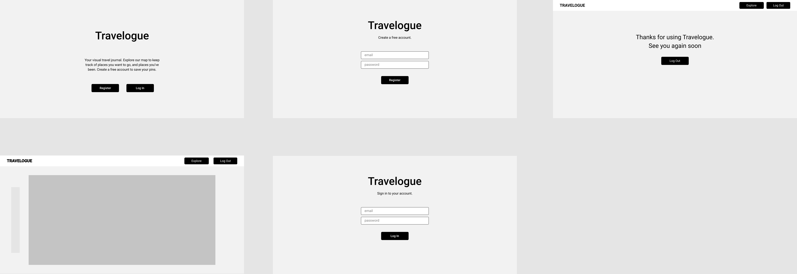

# Travelogue

### Epicodus Capstone Project

### By Kate Skorija
 

## Description
Travelogue is a visual resource for users to keep track of places they’ve been, and places they would like to go.
Users can explore a world map and place pins on locations, updating the pins with notes and photos as they wish.

  

## Component Diagram

  

## User Interface

These will be updated with screenshots of the project.

## User Stories
*  Allow users to navigate a world map easily (zoom, pan, etc)
*  Allow users to place pins on map to mark places they’ve been and add another color of pin for places they would like to go
*  Allow users to click on a placed pin and add/update/review notes they’ve made about that place (what to see/what they have seen, restaurants, people they met or traveled with, etc.)

  

## Known Bugs

There are no known bugs at this time.
 
  

## Support and Contact Details

If there are any issues or questions, please reach out to me through [my GitHub account](https://github.com/kate-skorija).
  

## Technologies Used

*  Git
*  CSS
*  JavaScript
*  JSX
*  React
*  Redux
*  OpenLayers (map)
*  Stamen (map tiles)
*  Webpack
*  npm
*  Jest
  

## Available Scripts

In the project directory, you can run:

### `npm start`

Runs the app in the development mode. 
Open [http://localhost:3000](http://localhost:3000) to view it in the browser.

The page will reload if you make edits. 
You will also see any lint errors in the console.

### `npm run build`

Builds the app for production to the `build` folder. 
It correctly bundles React in production mode and optimizes the build for the best performance.

The build is minified and the filenames include the hashes. 
Your app is ready to be deployed!

See the section about [deployment](https://facebook.github.io/create-react-app/docs/deployment) for more information.

## Learn More

You can learn more in the [Create React App documentation](https://facebook.github.io/create-react-app/docs/getting-started).

To learn React, check out the [React documentation](https://reactjs.org/).

### License

*This project uses the following license: [MIT](https://opensource.org/licenses/MIT)*

Copyright (c) 2020 **_Kate Skorija_** 

<!-- Where You Left Off:  -->
<!-- You were trying to create a new point on a map click; may need a separate createPoint.js? and to add state to explore and pass down methods -->
<!-- Check out the regular Draw example for Open Layers, compare to other examples -->